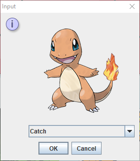
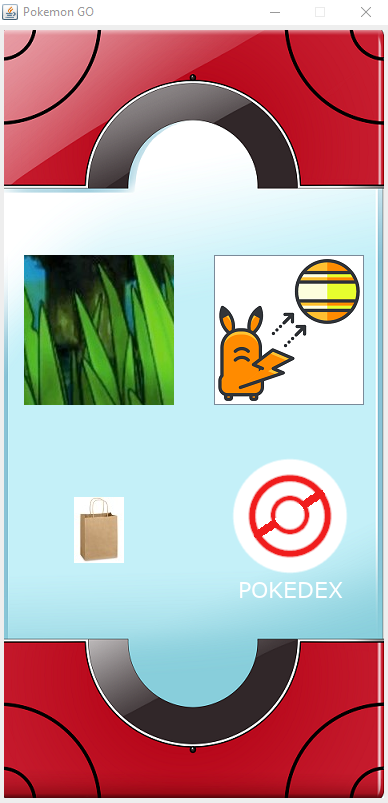
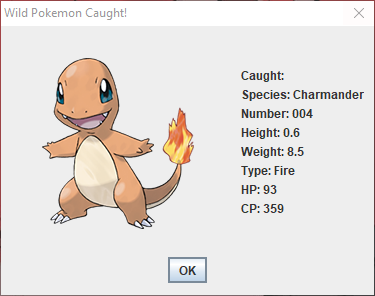

  
  
  
  

  This program is a simple game of Pong in Python. The purpose of this project is understanding the function of how to move objects within keystroke and learn Python's syntax. This program was coded on Visual Studio which was completely new to me at that time. This game is a two-player game using WASD (player-1) and the arrow key (player-2). Each player has its own class to keep scores whenever a ball hits the goal. The ball can be deflected by the player's paddle.

  The only thing that I did was modify and experiment with the game. At one time, I made the ball increase its speed by modifying the x and y coordinate. 

  Throughout this project, I learned more about working with a group. I found that it’s important that people should be given roles and responsibilities so that way it’ll become organized and straightforward. Additionally, I was able to understand other coding styles from my peers and because of this, it’ll help me implement different coding styles for future projects. Lastly, I learned more about how hierarchy and polymorphism work in Java and new fundamentals for writing Java GUI.

You can learn more at the [GitHub Repositories Website](https://github.com/cjsiador/final-project-pokemon-gui-f19-final-project-group-5-developChristian).

